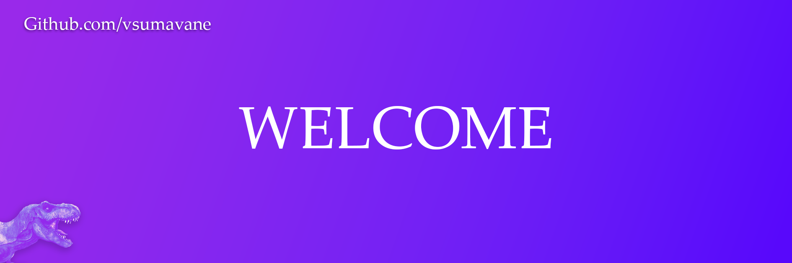

## Hi there, Welcome to My GitHub! :wave:

---

### :rocket: Welcome Banner

  <picture>
    <source media="(prefers-color-scheme: dark)" srcset="assets/banner-image-dark.png">
    <source media="(prefers-color-scheme: light)" srcset="assets/banner-image-light.png">
    
  </picture>

---

### :computer: Technologies I Work With:

---

### :chart_with_upwards_trend: GitHub Stats:

---

### :bar_chart: Other Stats:

---

### :link: Contacts and Socials:

---

### :books: About Me:

I’m a computer science student passionate about coding, chess (1500 on Chess.com, 1700 on Lichess), geopolitics, and machine learning. Currently, I’m diving deep into linear regression and working on exciting projects.

---
